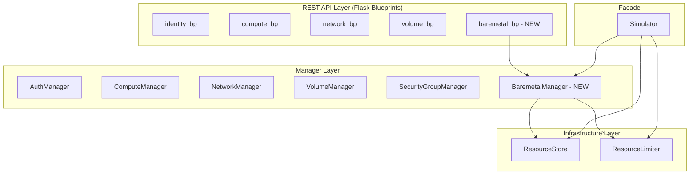
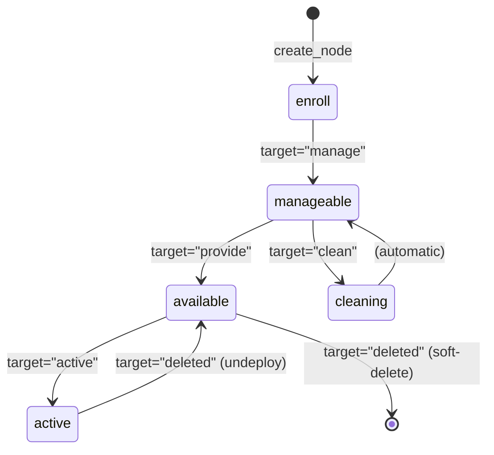

# Design Document: Ironic Baremetal Manager

## Overview

This design adds an Ironic (Bare Metal) manager to the OpenStack Simulator, following the same layered architecture as existing managers. The feature introduces two new data models (`BaremetalNode`, `BaremetalPort`), a `BaremetalManager` class with provision/power state machines, a Flask Blueprint for the REST API at `/baremetal/v1/`, and integration into the `Simulator` facade, `ResourceStore`, and `ResourceLimiter`.

The design mirrors the patterns established by `ComputeManager`, `VolumeManager`, and their corresponding API blueprints — using the shared `ResourceStore` for persistence, `ResourceLimiter` for quota enforcement, and the same exception hierarchy for error signaling.

## Architecture

The Ironic Baremetal Manager fits into the existing layered architecture:



**Key architectural decisions:**

1. **Single manager class** — `BaremetalManager` handles both nodes and ports (similar to how `NetworkManager` handles networks, subnets, routers, and ports). This keeps the Ironic domain cohesive.
2. **Store keyed by name for nodes, by MAC for ports** — Nodes use `name` as the store key (consistent with other managers). Ports use `address` (MAC) as the store key since MAC addresses are the natural unique identifier for network interfaces.
3. **State machine in the manager** — Provision and power state transitions are validated in the manager layer, raising `InvalidStateError` for illegal transitions. No separate state machine class is needed given the simplicity of the simulated states.

## Components and Interfaces

### BaremetalManager

Located at `openstack_simulator/managers/baremetal.py`.

```python
class BaremetalManager:
    def __init__(self, store: ResourceStore, limiter: ResourceLimiter) -> None: ...

    # Node operations
    def create_node(self, name: str, driver: str, memory_mb: int = 0,
                    cpus: int = 0, local_gb: int = 0, cpu_arch: str = "x86_64",
                    driver_info: dict | None = None,
                    properties: dict | None = None) -> BaremetalNode: ...
    def get_node(self, name: str) -> BaremetalNode | None: ...
    def list_nodes(self) -> list[BaremetalNode]: ...
    def update_node(self, name: str, **updates) -> BaremetalNode: ...
    def delete_node(self, name: str) -> None: ...
    def set_provision_state(self, name: str, target: str) -> BaremetalNode: ...
    def set_power_state(self, name: str, target: str) -> BaremetalNode: ...

    # Port operations
    def create_port(self, node_id: str, address: str) -> BaremetalPort: ...
    def list_ports(self, node_id: str | None = None) -> list[BaremetalPort]: ...
    def delete_port(self, address: str) -> None: ...
```

### REST API Blueprint

Located at `openstack_simulator/api/baremetal.py`, registered at `/baremetal/v1/`.

| Method | Endpoint | Description |
|--------|----------|-------------|
| GET | `/baremetal/v1/nodes` | List all active nodes |
| POST | `/baremetal/v1/nodes` | Create a new node |
| GET | `/baremetal/v1/nodes/<node_ident>` | Get node by name or UUID |
| PATCH | `/baremetal/v1/nodes/<node_ident>` | Update node properties |
| DELETE | `/baremetal/v1/nodes/<node_ident>` | Soft-delete a node |
| PUT | `/baremetal/v1/nodes/<node_ident>/states/power` | Change power state |
| PUT | `/baremetal/v1/nodes/<node_ident>/states/provision` | Change provision state |
| GET | `/baremetal/v1/ports` | List ports (optional `?node_id=` filter) |
| POST | `/baremetal/v1/ports` | Create a new port |
| DELETE | `/baremetal/v1/ports/<port_ident>` | Soft-delete a port |

### Integration Points

1. **ResourceStore** — Add `baremetal_nodes: dict[str, BaremetalNode]` and `baremetal_ports: dict[str, BaremetalPort]` attributes.
2. **ResourceLimiter** — Add `"baremetal_nodes"` and `"baremetal_ports"` to the limits dict.
3. **Simulator** — Instantiate `BaremetalManager` with shared store/limiter, expose as `self.baremetal_manager`. Add `max_baremetal_nodes` (default 10) and `max_baremetal_ports` (default 20) to `DEFAULT_CONFIG`.
4. **App factory** — Register `baremetal_bp` in `create_app()`. Add baremetal endpoint to service catalog in helpers.

## Data Models

### BaremetalNode

Added to `openstack_simulator/models.py`:

```python
@dataclass
class BaremetalNode:
    """Simulated Ironic baremetal node."""

    id: str
    name: str
    driver: str
    power_state: str
    provision_state: str
    memory_mb: int
    cpus: int
    local_gb: int
    cpu_arch: str
    driver_info: dict = field(default_factory=dict)
    properties: dict = field(default_factory=dict)
    status: str = "ACTIVE"
    created_at: str = ""
    updated_at: str = ""

    def to_dict(self) -> dict:
        return {
            "id": self.id,
            "name": self.name,
            "driver": self.driver,
            "power_state": self.power_state,
            "provision_state": self.provision_state,
            "memory_mb": self.memory_mb,
            "cpus": self.cpus,
            "local_gb": self.local_gb,
            "cpu_arch": self.cpu_arch,
            "driver_info": dict(self.driver_info),
            "properties": dict(self.properties),
            "status": self.status,
            "created_at": self.created_at,
            "updated_at": self.updated_at,
        }

    @classmethod
    def from_dict(cls, data: dict) -> BaremetalNode:
        return cls(
            id=data["id"],
            name=data["name"],
            driver=data["driver"],
            power_state=data["power_state"],
            provision_state=data["provision_state"],
            memory_mb=data["memory_mb"],
            cpus=data["cpus"],
            local_gb=data["local_gb"],
            cpu_arch=data["cpu_arch"],
            driver_info=dict(data.get("driver_info", {})),
            properties=dict(data.get("properties", {})),
            status=data.get("status", "ACTIVE"),
            created_at=data.get("created_at", ""),
            updated_at=data.get("updated_at", ""),
        )
```

### BaremetalPort

```python
@dataclass
class BaremetalPort:
    """Simulated Ironic baremetal port (network interface)."""

    id: str
    node_id: str
    address: str  # MAC address
    status: str = "ACTIVE"
    created_at: str = ""

    def to_dict(self) -> dict:
        return {
            "id": self.id,
            "node_id": self.node_id,
            "address": self.address,
            "status": self.status,
            "created_at": self.created_at,
        }

    @classmethod
    def from_dict(cls, data: dict) -> BaremetalPort:
        return cls(
            id=data["id"],
            node_id=data["node_id"],
            address=data["address"],
            status=data.get("status", "ACTIVE"),
            created_at=data.get("created_at", ""),
        )
```

### Provision State Machine



**Valid transitions map:**

| Current State | Target | New State | Side Effects |
|---------------|--------|-----------|--------------|
| enroll | manage | manageable | — |
| manageable | provide | available | — |
| manageable | clean | manageable | Passes through "cleaning" |
| available | active | active | power_state → "power on" |
| active | deleted | available | power_state → "power off" (undeploy) |
| available | deleted | DELETED | Soft-delete via store |

### Power State Machine

| Current Power State | Target | New Power State | Precondition |
|---------------------|--------|-----------------|--------------|
| power off | power on | power on | provision_state in {available, active} |
| power on | power off | power off | provision_state in {available, active} |
| power on | rebooting | power on | Passes through "rebooting" |
| * | * | — | provision_state in {enroll, manageable} → InvalidStateError |

## Correctness Properties

*A property is a characteristic or behavior that should hold true across all valid executions of a system — essentially, a formal statement about what the system should do. Properties serve as the bridge between human-readable specifications and machine-verifiable correctness guarantees.*

### Property 1: BaremetalNode serialization round-trip

*For any* valid `BaremetalNode` instance with arbitrary field values, calling `BaremetalNode.from_dict(node.to_dict())` SHALL produce a `BaremetalNode` equal to the original.

**Validates: Requirements 1.2, 1.3, 1.4**

### Property 2: BaremetalPort serialization round-trip

*For any* valid `BaremetalPort` instance with arbitrary field values, calling `BaremetalPort.from_dict(port.to_dict())` SHALL produce a `BaremetalPort` equal to the original.

**Validates: Requirements 2.2, 2.3, 2.4**

### Property 3: Node creation initial state invariant

*For any* valid node name, driver, and hardware parameters, a newly created node SHALL have `provision_state == "enroll"` and `power_state == "power off"`.

**Validates: Requirements 3.1**

### Property 4: Duplicate node name rejection

*For any* node name, if a non-deleted node with that name already exists, attempting to create another node with the same name SHALL raise `DuplicateResourceError`.

**Validates: Requirements 3.3**

### Property 5: Node quota enforcement

*For any* configured limit N, when exactly N non-deleted baremetal nodes exist, attempting to create an additional node SHALL raise `ResourceLimitExceededError`.

**Validates: Requirements 3.4**

### Property 6: Node store consistency

*For any* sequence of create and delete operations on nodes, `list_nodes()` SHALL return exactly the set of non-deleted nodes, `get_node(name)` SHALL return `None` for deleted or non-existent names, and `get_node(name)` SHALL return the node for any non-deleted name.

**Validates: Requirements 3.5, 4.1, 4.2, 4.3, 5.1, 5.3**

### Property 7: Valid provision state transitions

*For any* node in a valid source state, applying the corresponding target transition SHALL move the node to the expected destination state:
- enroll + "manage" → manageable
- manageable + "provide" → available
- manageable + "clean" → manageable
- available + "active" → active (with power_state = "power on")
- active + "deleted" → available (with power_state = "power off")

**Validates: Requirements 6.1, 6.2, 6.3, 6.4, 6.5**

### Property 8: Invalid provision state transitions

*For any* node and any target that is not a valid transition from the node's current provision_state, `set_provision_state` SHALL raise `InvalidStateError`.

**Validates: Requirements 6.6**

### Property 9: Valid power state transitions

*For any* node with provision_state in {"available", "active"}, setting power state to "power on" or "power off" SHALL update power_state accordingly, and setting "rebooting" on a powered-on node SHALL result in power_state "power on".

**Validates: Requirements 7.1, 7.2, 7.3**

### Property 10: Invalid power state transitions

*For any* node with provision_state in {"enroll", "manageable"}, any `set_power_state` call SHALL raise `InvalidStateError`.

**Validates: Requirements 7.4**

### Property 11: Mutation updates timestamp

*For any* successful state transition (provision or power) or node update, the node's `updated_at` field SHALL be updated to a timestamp later than or equal to the previous value.

**Validates: Requirements 6.7, 7.5, 12.4**

### Property 12: Port creation with valid node

*For any* valid MAC address and existing non-deleted node, `create_port` SHALL produce a `BaremetalPort` with a valid UUID id, the correct node_id, and an ISO 8601 created_at timestamp.

**Validates: Requirements 8.1**

### Property 13: Port creation with invalid node

*For any* node_id that does not correspond to an existing non-deleted node, `create_port` SHALL raise `ResourceNotFoundError`.

**Validates: Requirements 8.2**

### Property 14: Duplicate port MAC rejection

*For any* MAC address, if a non-deleted port with that address already exists, attempting to create another port with the same address SHALL raise `DuplicateResourceError`.

**Validates: Requirements 8.3**

### Property 15: Port listing with node filter

*For any* node_id, `list_ports(node_id=node_id)` SHALL return exactly the set of non-deleted ports whose `node_id` matches the filter, and no others.

**Validates: Requirements 8.4, 8.5**

## Error Handling

The `BaremetalManager` uses the existing exception hierarchy:

| Exception | Trigger | HTTP Status |
|-----------|---------|-------------|
| `DuplicateResourceError` | Creating node with existing name, creating port with existing MAC, renaming node to existing name | 409 |
| `ResourceLimitExceededError` | Node or port count at configured limit | 413 |
| `ResourceNotFoundError` | Operating on non-existent node/port, creating port for non-existent node | 404 |
| `InvalidStateError` | Invalid provision state transition, power state change on enroll/manageable node | 409 |

The REST API blueprint translates these exceptions to appropriate HTTP responses following the same pattern as `compute_bp`:

```python
try:
    result = sim.baremetal_manager.some_operation(...)
except ResourceNotFoundError as e:
    return jsonify({"error": {"message": str(e), "code": 404}}), 404
except DuplicateResourceError as e:
    return jsonify({"conflict": {"message": str(e), "code": 409}}), 409
except ResourceLimitExceededError as e:
    return jsonify({"overLimit": {"message": str(e), "code": 413}}), 413
except InvalidStateError as e:
    return jsonify({"conflict": {"message": str(e), "code": 409}}), 409
```

## Testing Strategy

### Property-Based Tests (Hypothesis)

The project uses Python with pytest. Property-based tests will use the **Hypothesis** library.

**Configuration:**
- Minimum 100 examples per property test (`@settings(max_examples=100)`)
- Each test tagged with a comment referencing the design property
- Tag format: `# Feature: ironic-baremetal-manager, Property N: <title>`

**Test file:** `tests/test_baremetal_properties.py`

**Generators needed:**
- `BaremetalNode` generator: random strings for name/driver/cpu_arch, random ints for memory_mb/cpus/local_gb, random dicts for driver_info/properties, valid provision/power states
- `BaremetalPort` generator: random UUID for id/node_id, random MAC address format, valid status values
- Provision state/target pair generators (valid and invalid)
- Power state/target pair generators (valid and invalid)

### Unit Tests (pytest)

**Test file:** `tests/test_baremetal_manager.py`

Unit tests cover:
- Specific examples of each CRUD operation
- Integration checks (Simulator facade wiring, ResourceStore attributes)
- Edge cases (empty strings, boundary values)

### Integration Tests (Flask test client)

**Test file:** `tests/test_baremetal_api.py`

Integration tests cover:
- Each REST endpoint with representative requests
- Error response format verification
- Authentication requirement enforcement
- Status code verification for all error paths

### Test Balance

- **Property tests** verify universal correctness (serialization, state machines, invariants)
- **Unit tests** verify specific examples and integration wiring
- **Integration tests** verify HTTP layer behavior with 2-3 examples per endpoint

