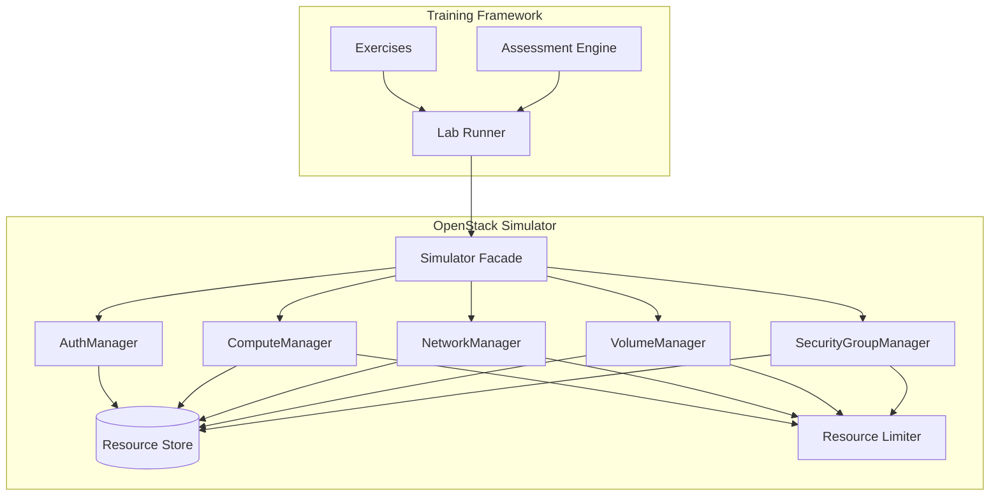
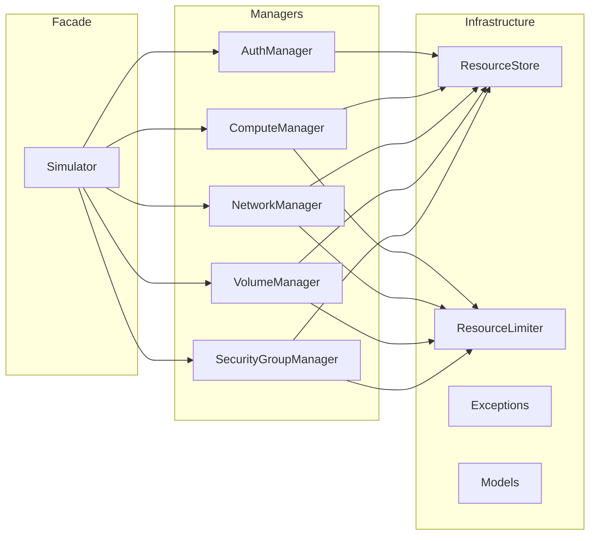
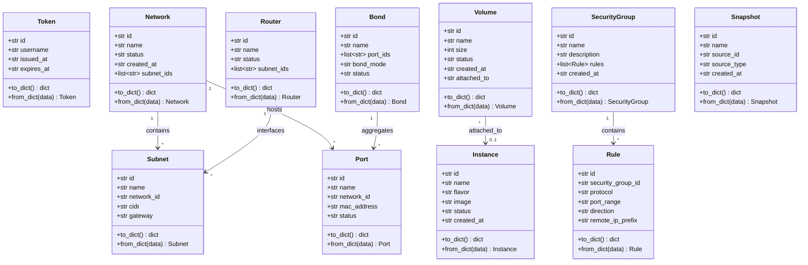
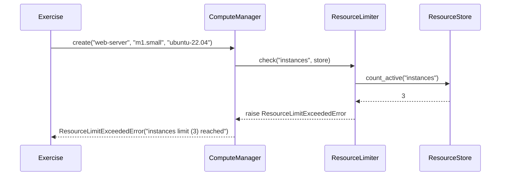

# Design Document: OpenStack Simulator for Training Labs

## Overview

The OpenStack Simulator is a pure-Python, in-memory simulation layer that implements the five manager interfaces expected by the `opcp-openstack-first-steps` training framework: `AuthManager`, `ComputeManager`, `NetworkManager`, `VolumeManager`, and `SecurityGroupManager`. It acts as a drop-in replacement for real OpenStack SDK calls, enabling all ~17 exercises across 7 lab modules to run without a live OpenStack environment.

### Design Goals

- **Fidelity**: Produce realistic UUIDs (v4), ISO 8601 timestamps, and status transitions so the assessment engine and exercises behave identically to a real environment.
- **Simplicity**: All state lives in-memory dictionaries — no database, no persistence, no network calls.
- **Compatibility**: Match the exact method signatures the training framework calls (`create`, `get`, `list`, `delete`, `resize`, `snapshot`, `attach`, `add_rule`, `delete_rule`, `create_subnet`, `create_router`, `add_router_interface`, `create_port`, `create_bond`).
- **Correctness**: Enforce resource limits, duplicate-name checks, status-based guards, and proper error signaling.
- **Testability**: Pure functions and clear interfaces make the simulator easy to test with both example-based and property-based tests.

### Key Design Decisions

| Decision | Choice | Rationale |
|---|---|---|
| State storage | In-memory dicts keyed by resource name | Simple, fast, sufficient for training scope |
| Resource identity | `uuid.uuid4()` per resource | Matches real OpenStack UUID format |
| Timestamps | `datetime.utcnow().isoformat() + "Z"` | ISO 8601, consistent with OpenStack API responses |
| Error signaling | Custom exception hierarchy | Allows exercises to catch specific error types |
| Package structure | Single `openstack_simulator` package | Installable via `pip install -e .` |
| Deletion strategy | Soft-delete (mark status as DELETED) | Matches OpenStack behavior; `list()` and `get()` filter out deleted resources |
| Token expiry | Real time comparison against `expires_at` | Simple and testable; session timeout configurable |

## Architecture

### High-Level Architecture



### Layered Design

The simulator follows a three-layer architecture:

1. **Facade Layer** (`Simulator`): Single entry point that initializes all managers, holds configuration, and exposes manager attributes (`auth_manager`, `compute_manager`, etc.).
2. **Manager Layer** (5 managers): Each manager implements the domain-specific API methods. Managers receive a reference to the shared `ResourceStore` and `ResourceLimiter`.
3. **Infrastructure Layer** (`ResourceStore`, `ResourceLimiter`, exceptions, models): Shared data storage, quota enforcement, data classes, and error types.



## Components and Interfaces

### Package Structure

```
openstack_simulator/
├── __init__.py              # Public API: exports Simulator class
├── simulator.py             # Simulator facade
├── models.py                # Data classes for all resource types
├── store.py                 # ResourceStore — in-memory storage
├── limiter.py               # ResourceLimiter — quota enforcement
├── exceptions.py            # Custom exception hierarchy
├── managers/
│   ├── __init__.py
│   ├── auth.py              # AuthManager
│   ├── compute.py           # ComputeManager
│   ├── network.py           # NetworkManager
│   ├── volume.py            # VolumeManager
│   └── security_group.py    # SecurityGroupManager
```

### Simulator Facade

```python
class Simulator:
    """Main entry point. Initializes all managers with shared state."""
    
    def __init__(self, config: dict | None = None):
        """
        Initialize the simulator with optional configuration overrides.
        
        Default config:
            default_flavor: "m1.small"
            default_image: "ubuntu-22.04"
            session_timeout: 120  (minutes)
            max_instances: 3
            max_networks: 2
            max_volumes: 3
            max_security_groups: 5
        """
        self.config: dict
        self.store: ResourceStore
        self.limiter: ResourceLimiter
        
        self.auth_manager: AuthManager
        self.compute_manager: ComputeManager
        self.network_manager: NetworkManager
        self.volume_manager: VolumeManager
        self.security_group_manager: SecurityGroupManager
```

### Exception Hierarchy

```python
class SimulatorError(Exception):
    """Base exception for all simulator errors."""

class AuthenticationError(SimulatorError):
    """Raised when authentication fails (empty credentials)."""

class TokenExpiredError(SimulatorError):
    """Raised when validating an expired token."""

class ResourceLimitExceededError(SimulatorError):
    """Raised when a resource creation exceeds the configured quota."""

class DuplicateResourceError(SimulatorError):
    """Raised when creating a resource with a name that already exists."""

class ResourceNotFoundError(SimulatorError):
    """Raised when referencing a resource that does not exist."""

class InvalidStateError(SimulatorError):
    """Raised when an operation is invalid for the resource's current state."""
```

### ResourceStore

```python
class ResourceStore:
    """Central in-memory storage for all simulated resources."""
    
    def __init__(self):
        self.instances: dict[str, Instance] = {}
        self.networks: dict[str, Network] = {}
        self.subnets: dict[str, Subnet] = {}
        self.routers: dict[str, Router] = {}
        self.ports: dict[str, Port] = {}
        self.bonds: dict[str, Bond] = {}
        self.volumes: dict[str, Volume] = {}
        self.security_groups: dict[str, SecurityGroup] = {}
        self.tokens: dict[str, Token] = {}
        self.snapshots: list[Snapshot] = []
    
    def add(self, resource_type: str, name: str, resource: Any) -> None:
        """Store a resource by type and name."""
    
    def get(self, resource_type: str, name: str) -> Any | None:
        """Retrieve a non-deleted resource by type and name. Returns None if not found or deleted."""
    
    def list_active(self, resource_type: str) -> list[Any]:
        """Return all non-deleted resources of the given type."""
    
    def mark_deleted(self, resource_type: str, name: str) -> None:
        """Set a resource's status to DELETED."""
    
    def count_active(self, resource_type: str) -> int:
        """Count non-deleted resources of the given type."""
```

### ResourceLimiter

```python
class ResourceLimiter:
    """Enforces maximum resource counts per type."""
    
    def __init__(self, limits: dict[str, int]):
        """
        Args:
            limits: Mapping of resource type to maximum count.
                    e.g. {"instances": 3, "networks": 2, "volumes": 3, "security_groups": 5}
        """
        self.limits: dict[str, int]
    
    def check(self, resource_type: str, store: ResourceStore) -> None:
        """Raise ResourceLimitExceededError if the active count equals the limit."""
    
    def get_limit(self, resource_type: str) -> int:
        """Return the configured limit for a resource type."""
```

### AuthManager

```python
class AuthManager:
    """Simulated Keystone authentication manager."""
    
    def __init__(self, store: ResourceStore, session_timeout: int = 120):
        self.store = store
        self.session_timeout = session_timeout  # minutes
    
    def authenticate(self, username: str, password: str) -> Token:
        """
        Authenticate a user and return a Token.
        
        Raises:
            AuthenticationError: If username or password is empty.
        """
    
    def validate_token(self, token: str) -> bool:
        """
        Validate a token by its UUID string.
        
        Returns True if valid and not expired.
        
        Raises:
            TokenExpiredError: If the token has expired.
            ResourceNotFoundError: If the token UUID is unknown.
        """
```

### ComputeManager

```python
class ComputeManager:
    """Simulated Nova compute manager."""
    
    def __init__(self, store: ResourceStore, limiter: ResourceLimiter):
        self.store = store
        self.limiter = limiter
    
    def create(self, name: str, flavor: str, image: str) -> Instance:
        """
        Create a new compute instance.
        
        Raises:
            ResourceLimitExceededError: If max_instances reached.
            DuplicateResourceError: If name already exists (non-deleted).
        """
    
    def get(self, name: str) -> Instance | None:
        """Get an instance by name. Returns None if not found."""
    
    def resize(self, name: str, flavor: str) -> Instance:
        """
        Resize an instance to a new flavor.
        
        Raises:
            ResourceNotFoundError: If instance not found.
        """
    
    def snapshot(self, name: str, snapshot_name: str) -> Snapshot:
        """
        Create a snapshot of an instance.
        
        Raises:
            ResourceNotFoundError: If instance not found.
        """
    
    def delete(self, name: str) -> None:
        """
        Soft-delete an instance.
        
        Raises:
            ResourceNotFoundError: If instance not found.
        """
    
    def list(self) -> list[Instance]:
        """Return all non-deleted instances."""
```

### NetworkManager

```python
class NetworkManager:
    """Simulated Neutron networking manager."""
    
    def __init__(self, store: ResourceStore, limiter: ResourceLimiter):
        self.store = store
        self.limiter = limiter
    
    def create(self, name: str) -> Network:
        """
        Create a new network.
        
        Raises:
            ResourceLimitExceededError: If max_networks reached.
            DuplicateResourceError: If name already exists (non-deleted).
        """
    
    def get(self, name: str) -> Network | None:
        """Get a network by name. Returns None if not found."""
    
    def create_subnet(self, network_name: str, name: str, cidr: str, gateway: str) -> Subnet:
        """
        Create a subnet on an existing network.
        
        Raises:
            ResourceNotFoundError: If network not found.
        """
    
    def create_router(self, name: str) -> Router:
        """Create a new router."""
    
    def add_router_interface(self, router_name: str, subnet_id: str) -> None:
        """
        Associate a subnet with a router.
        
        Raises:
            ResourceNotFoundError: If router or subnet not found.
        """
    
    def create_port(self, network_name: str, name: str) -> Port:
        """
        Create a port on an existing network.
        
        Raises:
            ResourceNotFoundError: If network not found.
        """
    
    def create_bond(self, name: str, port_names: list[str], bond_mode: str) -> Bond:
        """
        Create a LACP bond from existing ports.
        
        Raises:
            ResourceNotFoundError: If any port not found.
        """
    
    def delete(self, name: str) -> None:
        """
        Soft-delete a network.
        
        Raises:
            ResourceNotFoundError: If network not found.
        """
    
    def list(self) -> list[Network]:
        """Return all non-deleted networks."""
```

### VolumeManager

```python
class VolumeManager:
    """Simulated Cinder storage manager."""
    
    def __init__(self, store: ResourceStore, limiter: ResourceLimiter):
        self.store = store
        self.limiter = limiter
    
    def create(self, name: str, size: int) -> Volume:
        """
        Create a new volume.
        
        Raises:
            ResourceLimitExceededError: If max_volumes reached.
            DuplicateResourceError: If name already exists (non-deleted).
        """
    
    def get(self, name: str) -> Volume | None:
        """Get a volume by name. Returns None if not found."""
    
    def attach(self, volume_name: str, instance_name: str) -> Volume:
        """
        Attach a volume to an instance.
        
        Raises:
            ResourceNotFoundError: If volume or instance not found.
            InvalidStateError: If volume is already in-use.
        """
    
    def snapshot(self, name: str, snapshot_name: str) -> Snapshot:
        """
        Create a snapshot of a volume.
        
        Raises:
            ResourceNotFoundError: If volume not found.
        """
    
    def delete(self, name: str) -> None:
        """
        Soft-delete a volume.
        
        Raises:
            ResourceNotFoundError: If volume not found.
            InvalidStateError: If volume is in-use.
        """
    
    def list(self) -> list[Volume]:
        """Return all non-deleted volumes."""
```

### SecurityGroupManager

```python
class SecurityGroupManager:
    """Simulated Neutron security group manager."""
    
    def __init__(self, store: ResourceStore, limiter: ResourceLimiter):
        self.store = store
        self.limiter = limiter
    
    def create(self, name: str, description: str) -> SecurityGroup:
        """
        Create a new security group.
        
        Raises:
            ResourceLimitExceededError: If max_security_groups reached.
            DuplicateResourceError: If name already exists (non-deleted).
        """
    
    def get(self, name: str) -> SecurityGroup | None:
        """Get a security group by name. Returns None if not found."""
    
    def add_rule(self, sg_name: str, protocol: str, port_range: str,
                 direction: str, remote_ip_prefix: str) -> Rule:
        """
        Add a rule to a security group.
        
        Raises:
            ResourceNotFoundError: If security group not found.
        """
    
    def delete_rule(self, rule_id: str) -> None:
        """
        Remove a rule by its UUID.
        
        Raises:
            ResourceNotFoundError: If rule not found.
        """
    
    def delete(self, name: str) -> None:
        """
        Soft-delete a security group.
        
        Raises:
            ResourceNotFoundError: If security group not found.
        """
    
    def list(self) -> list[SecurityGroup]:
        """Return all non-deleted security groups."""
```

## Data Models

All models are Python `dataclasses` with `to_dict()` and `from_dict()` class methods for serialization round-trips.



### Model Details

#### Token
| Field | Type | Description |
|---|---|---|
| `id` | `str` | UUID v4 |
| `username` | `str` | Authenticated username |
| `issued_at` | `str` | ISO 8601 timestamp |
| `expires_at` | `str` | ISO 8601 timestamp (issued_at + session_timeout) |

#### Instance
| Field | Type | Description |
|---|---|---|
| `id` | `str` | UUID v4 |
| `name` | `str` | User-provided name |
| `flavor` | `str` | Flavor identifier (e.g., "m1.small") |
| `image` | `str` | Image identifier (e.g., "ubuntu-22.04") |
| `status` | `str` | One of: "BUILDING", "ACTIVE", "RESIZE", "DELETED" |
| `created_at` | `str` | ISO 8601 timestamp |

#### Network
| Field | Type | Description |
|---|---|---|
| `id` | `str` | UUID v4 |
| `name` | `str` | User-provided name |
| `status` | `str` | One of: "ACTIVE", "DELETED" |
| `created_at` | `str` | ISO 8601 timestamp |
| `subnet_ids` | `list[str]` | UUIDs of associated subnets |

#### Subnet
| Field | Type | Description |
|---|---|---|
| `id` | `str` | UUID v4 |
| `name` | `str` | User-provided name |
| `network_id` | `str` | UUID of parent network |
| `cidr` | `str` | CIDR notation (e.g., "192.168.1.0/24") |
| `gateway` | `str` | Gateway IP (e.g., "192.168.1.1") |

#### Router
| Field | Type | Description |
|---|---|---|
| `id` | `str` | UUID v4 |
| `name` | `str` | User-provided name |
| `status` | `str` | One of: "ACTIVE", "DELETED" |
| `subnet_ids` | `list[str]` | UUIDs of connected subnets |

#### Port
| Field | Type | Description |
|---|---|---|
| `id` | `str` | UUID v4 |
| `name` | `str` | User-provided name |
| `network_id` | `str` | UUID of parent network |
| `mac_address` | `str` | Generated MAC address (e.g., "fa:16:3e:xx:xx:xx") |
| `status` | `str` | One of: "ACTIVE", "DELETED" |

#### Bond
| Field | Type | Description |
|---|---|---|
| `id` | `str` | UUID v4 |
| `name` | `str` | User-provided name |
| `port_ids` | `list[str]` | UUIDs of aggregated ports |
| `bond_mode` | `str` | LACP bond mode (e.g., "802.3ad") |
| `status` | `str` | One of: "ACTIVE", "DELETED" |

#### Volume
| Field | Type | Description |
|---|---|---|
| `id` | `str` | UUID v4 |
| `name` | `str` | User-provided name |
| `size` | `int` | Size in GB |
| `status` | `str` | One of: "available", "in-use", "DELETED" |
| `created_at` | `str` | ISO 8601 timestamp |
| `attached_to` | `str | None` | Instance name if attached, else None |

#### SecurityGroup
| Field | Type | Description |
|---|---|---|
| `id` | `str` | UUID v4 |
| `name` | `str` | User-provided name |
| `description` | `str` | User-provided description |
| `rules` | `list[Rule]` | Associated rules |
| `created_at` | `str` | ISO 8601 timestamp |
| `status` | `str` | One of: "ACTIVE", "DELETED" |

#### Rule
| Field | Type | Description |
|---|---|---|
| `id` | `str` | UUID v4 |
| `security_group_id` | `str` | UUID of parent security group |
| `protocol` | `str` | Protocol (e.g., "tcp", "udp", "icmp") |
| `port_range` | `str` | Port range (e.g., "80:80", "22:22") |
| `direction` | `str` | "ingress" or "egress" |
| `remote_ip_prefix` | `str` | CIDR (e.g., "0.0.0.0/0") |

#### Snapshot
| Field | Type | Description |
|---|---|---|
| `id` | `str` | UUID v4 |
| `name` | `str` | User-provided snapshot name |
| `source_id` | `str` | UUID of source resource (instance or volume) |
| `source_type` | `str` | "instance" or "volume" |
| `created_at` | `str` | ISO 8601 timestamp |

## Correctness Properties

*A property is a characteristic or behavior that should hold true across all valid executions of a system — essentially, a formal statement about what the system should do. Properties serve as the bridge between human-readable specifications and machine-verifiable correctness guarantees.*

### Property 1: Authentication round-trip

*For any* non-empty username and non-empty password, authenticating with the AuthManager and then validating the returned token SHALL succeed, and the token SHALL contain the original username, a valid UUID, an `issued_at` timestamp, and an `expires_at` timestamp exactly `session_timeout` minutes after `issued_at`.

**Validates: Requirements 2.1, 2.3, 2.5**

### Property 2: Empty credentials rejection

*For any* username/password pair where at least one is an empty string, authenticating with the AuthManager SHALL raise an AuthenticationError.

**Validates: Requirements 2.2**

### Property 3: Create-get round-trip (all resource types)

*For any* resource type (instance, network, volume, security group) and *for any* valid creation parameters with a unique name within the resource limit, creating the resource through its manager and then getting it by name SHALL return a resource with matching name, status, and all creation-time attributes.

**Validates: Requirements 3.4, 3.8, 4.4, 4.10, 6.4, 6.10, 7.4, 7.9, 10.2, 10.4**

### Property 4: Get nonexistent returns None (all resource types)

*For any* resource type and *for any* name that has not been used to create a resource, calling `get(name)` on the corresponding manager SHALL return None without raising an error.

**Validates: Requirements 3.5, 4.5, 6.5, 7.5, 10.3**

### Property 5: Resource limit enforcement (all limited types)

*For any* limited resource type (instances, networks, volumes, security groups), when the number of non-deleted resources equals the configured maximum, attempting to create one more SHALL raise a ResourceLimitExceededError.

**Validates: Requirements 3.2, 4.2, 6.2, 7.2, 9.1, 9.2, 9.3, 9.4**

### Property 6: Duplicate name rejection (all resource types)

*For any* resource type and *for any* name, creating a resource with that name and then attempting to create another resource of the same type with the same name SHALL raise a DuplicateResourceError.

**Validates: Requirements 3.3, 4.3, 6.3, 7.3**

### Property 7: Delete excludes from get and frees quota

*For any* resource type and *for any* created resource, deleting it by name SHALL cause subsequent `get(name)` to return None, SHALL exclude it from `list()` results, and SHALL allow a new resource to be created even if the limit was previously reached.

**Validates: Requirements 9.5, 11.1, 11.4, 12.1**

### Property 8: Delete nonexistent raises error

*For any* resource type and *for any* name that does not correspond to an existing non-deleted resource, calling `delete(name)` SHALL raise a ResourceNotFoundError.

**Validates: Requirements 11.2**

### Property 9: UUID validity and uniqueness

*For any* set of resources created by the simulator (across all resource types), every resource UUID SHALL be a valid version-4 UUID matching the format `[0-9a-f]{8}-[0-9a-f]{4}-4[0-9a-f]{3}-[89ab][0-9a-f]{3}-[0-9a-f]{12}`, and no two resources SHALL share the same UUID.

**Validates: Requirements 8.1, 8.3, 8.4**

### Property 10: ISO 8601 timestamps

*For any* resource created by the simulator that has a `created_at` field, the timestamp SHALL be a valid ISO 8601 string that can be parsed back to a datetime object.

**Validates: Requirements 8.2**

### Property 11: Instance resize updates flavor

*For any* existing instance and *for any* new flavor string, calling `resize(name, flavor)` SHALL update the instance's flavor to the new value and the instance SHALL have status "ACTIVE" after the operation.

**Validates: Requirements 3.6**

### Property 12: Instance snapshot creation

*For any* existing instance and *for any* snapshot name, calling `snapshot(name, snapshot_name)` SHALL create a snapshot record with the instance's UUID as `source_id`, a valid UUID, the given name, and a `created_at` timestamp.

**Validates: Requirements 3.7**

### Property 13: Subnet creation associates with network

*For any* existing network and *for any* valid subnet parameters (name, CIDR, gateway), calling `create_subnet` SHALL create a subnet with a valid UUID and the subnet's ID SHALL appear in the network's `subnet_ids` list.

**Validates: Requirements 4.6**

### Property 14: Subnet on nonexistent network raises error

*For any* network name that does not correspond to an existing network, calling `create_subnet` SHALL raise a ResourceNotFoundError.

**Validates: Requirements 4.7**

### Property 15: Port creation on existing network

*For any* existing network and *for any* port name, calling `create_port` SHALL return a port with a valid UUID, the correct `network_id`, a generated MAC address, and status "ACTIVE".

**Validates: Requirements 5.1, 5.5**

### Property 16: Port on nonexistent network raises error

*For any* network name that does not correspond to an existing network, calling `create_port` SHALL raise a ResourceNotFoundError.

**Validates: Requirements 5.2**

### Property 17: Bond creation from existing ports

*For any* set of existing ports and *for any* bond name and bond mode, calling `create_bond` SHALL return a bond with a valid UUID, references to all specified port IDs, the given bond mode, and status "ACTIVE".

**Validates: Requirements 5.3**

### Property 18: Bond with nonexistent port raises error

*For any* list of port names where at least one does not correspond to an existing port, calling `create_bond` SHALL raise a ResourceNotFoundError.

**Validates: Requirements 5.4**

### Property 19: Volume attach updates status and records attachment

*For any* existing volume with status "available" and *for any* existing instance, calling `attach(volume_name, instance_name)` SHALL set the volume status to "in-use" and record the instance name in `attached_to`.

**Validates: Requirements 6.6**

### Property 20: Volume attach with nonexistent references raises error

*For any* attach call where the volume name or instance name does not correspond to an existing resource, the VolumeManager SHALL raise a ResourceNotFoundError.

**Validates: Requirements 6.7**

### Property 21: Double-attach raises invalid state error

*For any* volume that is already in status "in-use", attempting to attach it to any instance SHALL raise an InvalidStateError.

**Validates: Requirements 6.8**

### Property 22: Volume snapshot creation

*For any* existing volume and *for any* snapshot name, calling `snapshot(name, snapshot_name)` SHALL create a snapshot record with the volume's UUID as `source_id`, a valid UUID, the given name, and a `created_at` timestamp.

**Validates: Requirements 6.9**

### Property 23: Delete in-use volume raises invalid state error

*For any* volume with status "in-use", calling `delete(name)` SHALL raise an InvalidStateError.

**Validates: Requirements 11.3**

### Property 24: Security group rule add and delete round-trip

*For any* existing security group and *for any* valid rule parameters, adding a rule SHALL increase the rules list length by one and the rule SHALL have the specified parameters. Subsequently deleting that rule by its UUID SHALL remove it from the security group's rules list.

**Validates: Requirements 7.6, 7.8**

### Property 25: Add rule to nonexistent security group raises error

*For any* security group name that does not correspond to an existing security group, calling `add_rule` SHALL raise a ResourceNotFoundError.

**Validates: Requirements 7.7**

### Property 26: Serialization round-trip

*For any* resource created by the simulator, calling `to_dict()` and then `from_dict()` on the result SHALL produce a resource equivalent to the original.

**Validates: Requirements 12.2, 12.3**

### Property 27: List returns only non-deleted resources

*For any* sequence of create and delete operations on a resource type, calling `list()` SHALL return exactly the set of resources that have not been deleted.

**Validates: Requirements 12.1**

## Error Handling

### Exception Strategy

All errors are signaled via a custom exception hierarchy rooted at `SimulatorError`. This allows the training framework to catch specific error types or broadly catch all simulator errors.

| Exception | Trigger | HTTP Analogy |
|---|---|---|
| `AuthenticationError` | Empty username or password | 401 Unauthorized |
| `TokenExpiredError` | Validating an expired token | 401 Unauthorized |
| `ResourceLimitExceededError` | Creating a resource when quota is full | 413 / 429 |
| `DuplicateResourceError` | Creating a resource with an existing name | 409 Conflict |
| `ResourceNotFoundError` | Operating on a nonexistent resource | 404 Not Found |
| `InvalidStateError` | Operation invalid for current state (e.g., delete in-use volume) | 409 Conflict |

### Error Handling Patterns

1. **Validation-first**: Each manager method validates preconditions (limits, existence, state) before mutating state. This ensures the ResourceStore is never left in an inconsistent state.
2. **No partial mutations**: If a multi-step operation fails (e.g., `create_bond` with one invalid port), no state changes are committed.
3. **Descriptive messages**: Each exception includes a human-readable message identifying the resource type, name, and reason for failure.

### Error Flow Example



## Testing Strategy

### Testing Framework

- **Test runner**: `pytest`
- **Property-based testing**: `hypothesis` (Python's standard PBT library)
- **Coverage**: `pytest-cov`

### Test Structure

```
tests/
├── conftest.py                    # Shared fixtures (fresh Simulator, managers)
├── test_models.py                 # Model serialization round-trips
├── test_store.py                  # ResourceStore unit tests
├── test_limiter.py                # ResourceLimiter unit tests
├── test_auth_manager.py           # Auth manager tests
├── test_compute_manager.py        # Compute manager tests
├── test_network_manager.py        # Network manager tests
├── test_volume_manager.py         # Volume manager tests
├── test_security_group_manager.py # Security group manager tests
├── test_simulator.py              # Facade initialization tests
└── test_properties.py             # Cross-cutting property-based tests
```

### Dual Testing Approach

**Unit tests** (example-based) cover:
- Initialization and configuration (Requirements 1.1–1.4)
- Specific error scenarios with concrete values
- Assessment engine resource type mapping (Requirement 10.1)
- Router interface association (Requirement 4.9)
- Token expiry with time mocking (Requirement 2.4)

**Property-based tests** (Hypothesis) cover:
- All 27 correctness properties defined above
- Each property test runs a minimum of 100 iterations
- Each test is tagged with: `Feature: openstack-simulator, Property {N}: {title}`
- Hypothesis strategies generate random resource names, flavors, images, sizes, descriptions, CIDR blocks, protocols, port ranges, etc.

### Hypothesis Strategy Examples

```python
from hypothesis import given, settings
from hypothesis.strategies import text, integers

# Strategy for valid resource names (non-empty, no whitespace-only)
resource_names = text(min_size=1, max_size=50).filter(lambda s: s.strip())

# Strategy for volume sizes
volume_sizes = integers(min_value=1, max_value=1000)

# Strategy for valid CIDR blocks
cidrs = ...  # Custom strategy generating valid CIDR notation

# Strategy for protocols
protocols = sampled_from(["tcp", "udp", "icmp"])
```

### Test Configuration

```python
# Each property test uses at least 100 examples
@settings(max_examples=100)
@given(name=resource_names, flavor=resource_names, image=resource_names)
def test_property_3_create_get_round_trip_instance(name, flavor, image):
    """Feature: openstack-simulator, Property 3: Create-get round-trip"""
    ...
```

### Coverage Targets

- Line coverage: ≥ 95%
- Branch coverage: ≥ 90%
- All acceptance criteria covered by at least one test (unit or property)

